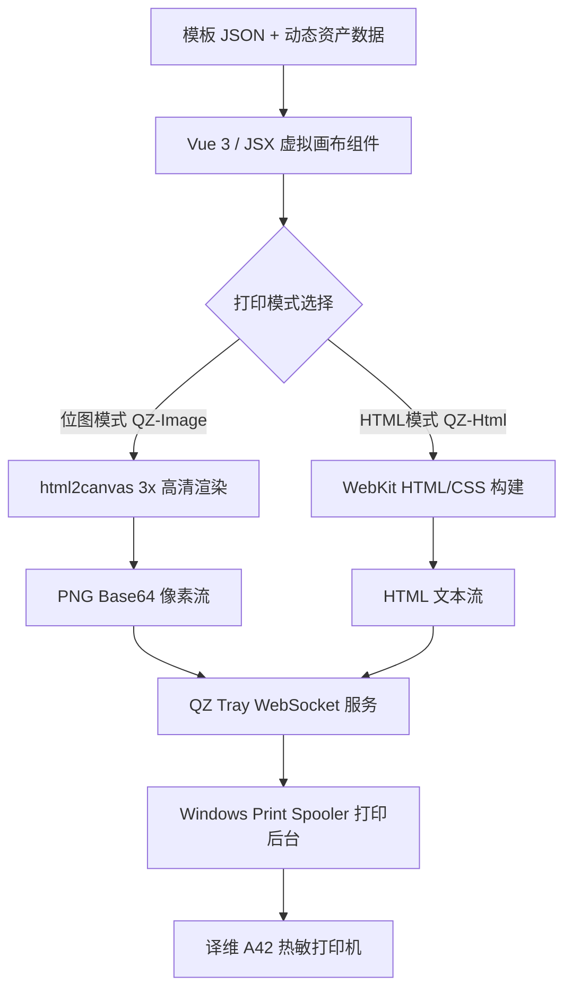

# Web端热敏标签打印完整解决方案：Vue 3 + QZ Tray + 译维A42 (Windows驱动/位图模式) 实践指南

> **摘要**：本文详细梳理了在 Vue 3 前端项目中，如何通过 **QZ Tray** 静默打印服务、**译维 A42 热敏打印机 (Windows GDI 驱动)** 以及 **位图/HTML 渲染模式**，实现高性能、像素级对齐、无跨页/跳页的高可用 Web 标签打印系统。总结了针对物理纸张尺寸错配、QZ 方向翻转陷阱、浅色字断针虚影、多余空白尾页及双边框等经典坑点的全套解决方案。

---

## 一、 架构设计与整体流程

### 1.1 传统方案 vs 本方案对比

在传统热敏标签打印中，通常有以下两种路线：

| 维度 | TSPL/CPCL 原始指令模式 | 本方案 (Vue 3 + QZ Tray + Windows GDI / 位图模式) |
| :--- | :--- | :--- |
| **开发成本** | 需手写低级指令，定位复杂，难以预览 | 采用 Vue 3 可视化拖拽组件，**所见即所得** |
| **打印机兼容性** | 绑定特定品牌指令集 (如 TSC/Zebra) | **驱动通用**，只要 Windows 能安装驱动即可打印 |
| **富文本与排版** | 复杂表格、二维码、自适应字号实现困难 | 完美支持 CSS 任意排版、多列表格、图片与二维码 |
| **维护性** | 修改模板需重新编写逻辑指令 | 修改 JSON 模板即可，支持动态变量插值 |

### 1.2 系统架构与数据流



---

## 二、 核心技术实现细节

### 2.1 画布基准与自适应缩放机制

为了保证屏幕视口（通常为 `96 DPI`）与热敏打印硬件（通常为 `203 DPI` 或 `300 DPI`）精确对齐，系统建立了统一的物理换算约定：

- **物理换算比例**：`1 mm = 5 px`
- **标准标签规格**：以 `80 mm × 60 mm` 为例，设计器画布物理像素为 **`400 px × 300 px`**。
- **自适应 CSS 缩放公式**：
  $$\text{Scale} = \frac{\text{width}_{\text{mm}}}{\text{width}_{\text{px}}}$$
  在打印 HTML 构建时应用：
  ```css
  transform: scale(calc(${widthMm}mm / ${page.width}px));
  transform-origin: 0 0;
  ```

### 2.2 位图打印模式 (`qzImagePrint`) 渲染逻辑

利用 `html2canvas` 在浏览器内存中将 DOM 转换为无损 PNG 图像，回避了不同操作系统与打印机驱动对 HTML 字体渲染的细微差异：

```javascript
// src/utils/printService.js
export async function pagesToPngBase64(pages) {
  const host = document.createElement('div');
  host.style.cssText = 'position:fixed;left:-99999px;top:0;background:#fff;pointer-events:none;';
  document.body.appendChild(host);

  const results = [];
  try {
    for (const page of pages) {
      const wrap = document.createElement('div');
      wrap.style.cssText = `width:${page.width}px;height:${page.height}px;background:#fff;overflow:hidden;position:relative;`;
      wrap.innerHTML = `<style>${PRINT_CSS}</style>${page.html}`;
      host.appendChild(wrap);

      await sleep(50);
      const canvas = await html2canvas(wrap, {
        backgroundColor: '#ffffff',
        scale: 3, // 300 DPI 高清高黑度渲染
        useCORS: true,
        allowTaint: false,
        width: page.width,
        height: page.height,
        x: 0,
        y: 0,
        scrollX: 0,
        scrollY: 0,
        logging: false
      });

      const dataUrl = canvas.toDataURL('image/png');
      const base64 = dataUrl.replace(/^data:image\/png;base64,/, '');
      results.push({
        base64,
        width: page.width,
        height: page.height,
        widthMm: page.width / PX_PER_MM,
        heightMm: page.height / PX_PER_MM
      });
      wrap.remove();
    }
  } finally {
    host.remove();
  }
  return results;
}
```

---

## 三、 避坑指南与踩坑全锦囊 (Troubleshooting Guide)

在译维 A42 热敏打印机与 QZ Tray 的实际对接过程中，我们攻克了 6 个关键问题，整理如下：

### 陷阱 1：QZ Tray 宽高自动翻转导致单张标签跨 2 张纸

- **现象**：排版无误，但打印 1 张标签时，打印机强制走纸 80mm（打完 60mm 标签后，将剩下的 20mm 溢出打印到第 2 张纸上）。
- **根源**：在调用 QZ Tray 的 `qz.configs.create()` 时，若传入了 `orientation: 'landscape'`，Java `PrintService` 内部会将自定义尺寸 `size: { width: 80, height: 60 }` **自动互换为 `60mm × 80mm`**，导致驱动误以为纸高是 80mm。
- **解法**：从 QZ 配置中**完全移除 `orientation` 参数**（或设为 `null`），让 QZ Tray 直接原样把 `width: 80, height: 60` 交付给 Windows 驱动：
  ```javascript
  // 修正后的 QZ 配置
  const config = qz.configs.create(printerName, {
    units: 'mm',
    size: { width: widthMm, height: heightMm },
    margins: 0,
    colorType: 'grayscale',
    interpolation: 'nearest-neighbor',
    scaleContent: true,
    rasterize: true,
    jobName: `标签打印`
  });
  ```

---

### 陷阱 2：Windows 驱动默认底纸尺寸错配导致裁切与跨页

- **现象**：打印出来的标签**左侧 1/5 被裁切丢弃**，且上下内容被分成 2 张纸输出。
- **根源**：Windows 操作系统打印后台 (Spooler) 拥有最高控制权。若 Windows 【打印首选项】中的默认底纸停留在 `50×35 mm`：
  1. 80mm 宽的图像强塞进 50mm 驱动视口 $\rightarrow$ **左侧 30mm 被截断**。
  2. 60mm 高的图像塞进 35mm 驱动视口 $\rightarrow$ **溢出换页输出到 2 张纸**。
- **解法**：在 Windows 控制面板中完成驱动底纸配置：
  1. 打开控制面板 $\rightarrow$ 设备和打印机 $\rightarrow$ 右键 **译维 A42** $\rightarrow$ 点击 **【打印首选项】**。
  2. 在【页面设置】中新建规格：**宽度 `80 mm`**，**高度 `60 mm`**，**边距 `0`**。
  3. 将该 `80×60mm` 规格设为打印机的默认底纸。
  4. 长按打印机上的进纸按键，执行硬件缝隙感应校准。

---

### 陷阱 3：单页打印后多吐出一张空白页

- **现象**：打印正文标签正常，但每次打印完毕后，打印机总是会额外多吐出一张完全空白的标签纸。
- **根源**：单页 HTML 样式中包含了 `page-break-after: always;`，WebKit 引擎在渲染单页 HTML 时强制在末尾插入了第 2 个空白页节点。
- **解法**：在单页及尾页样式中强制禁用换页，并清理 DOM 尾部的多余换行符：
  ```css
  .print-label-page {
    width: 80mm;
    height: 60mm;
    position: relative;
    overflow: hidden;
    background: #ffffff;
    page-break-after: avoid !important;
    break-after: avoid !important;
  }
  ```

---

### 陷阱 4：细字体线条断针、虚影、显色浅像缺油墨

- **现象**：粗体字正常，但常规体或细汉字（如“资产编号”中的 1px 笔画）线条断断续续、显色极淡。
- **根源**：热敏打印机依靠加热使纸张变黑，无半透明灰阶。网页默认浅灰色抗锯齿 (Anti-Aliasing) 在 203 DPI 热敏阈值下被二值化丢弃，导致笔画断裂。
- **解法**：
  1. **前端 CSS 强化**：
     ```css
     * {
       box-sizing: border-box;
       -webkit-font-smoothing: antialiased;
       text-rendering: geometricPrecision;
     }
     html, body, .component {
       color: #000000 !important;
       font-family: "SimHei", "Microsoft YaHei", sans-serif;
     }
     ```
  2. **提高采样分辨率**：将 `html2canvas` 的采样倍率提高至 **`scale: 3`** (相当于 300 DPI 高清化)。
  3. **驱动硬件调节**：在 Windows【打印首选项】中，将 **打印浓度 (Darkness)** 调高至 **`12 ~ 14`**，并将 **打印速度 (Speed)** 降至 **`2.0 ~ 3.0 in/s`**（给予打印头充足的加热反应时间）。

---

### 陷阱 5：表格位图打印产生重影“双边框”

- **现象**：表格线条粗细不一，看起来像叠加了双边框。
- **根源**：全局 `PRINT_CSS` 对 `th/td` 强加了 `border: 1px solid #000`，而 `PreviewTable.vue` 内层 `div` 也自带边框，两重边框叠加；同时 `TableUi.vue` 带有 `cellspacing="1px"`。
- **解法**：
  1. 移除 `PRINT_CSS` 中对 `th/td` 的多余 `border` 声明。
  2. 将表格标签属性统一改为 `cellspacing="0"`，使用 CSS `border-collapse: collapse;` 保持标准的 1px 干净单边框。

---

### 陷阱 6：设计器编辑画布与打印预览像素错位

- **现象**：在设计器中矩形框刚好盖住 3 行表格，但在预览和打印时矩形框底部超出了 3 行。
- **根源**：
  1. 物料拖拽容器 [Drag.vue](file:///Users/dylan/CodeHub/HanTian/label-designer-v3/src/components/LabelDesigner/components/Drag.vue) 中硬编码了 `padding: 0 10px 0 0`（右侧强制留白 10px）。
  2. 表格设计组件 [TableUi.vue](file:///Users/dylan/CodeHub/HanTian/label-designer-v3/src/components/LabelDesigner/elements/TableUi.vue) 底部带有 `<div class="table-wrap__place" style="height:30px">` 伪占位块，导致设计器中表格高被压缩了 30px，而预览中表格高度展开为完整的 100%。
- **解法**：
  - 将 [Drag.vue](file:///Users/dylan/CodeHub/HanTian/label-designer-v3/src/components/LabelDesigner/components/Drag.vue) 的 `padding` 设为 `0`。
  - 彻底删除 `table-wrap__place` 占位块，将 `TableUi.vue` 与 `PreviewTable.vue` 统一设置为 `height: 100%`。
  - **效果**：编辑画布与预览打印实现 **100% 像素级对齐**。

---

## 四、 部署与生产环境 CheckList

上线部署前，请对照以下检查清单核对：

- [x] **QZ Tray 客户端证书**：生产环境配置合法的数字签名证书（防止弹出浏览器授权弹窗）。
- [x] **Windows 驱动首选项**：默认底纸设为 `80mm × 60mm`，边距设为 `0`。
- [x] **硬件加热设置**：打印黑度设为 `12~14`，速度降至 `2.0~3.0 in/s`。
- [x] **QZ Config 参数**：确认 `qz.configs.create` 中已移除 `orientation` 配置。
- [x] **采样倍率**：确认 `html2canvas` 的 `scale` 为 `3`。
- [x] **CSS 分页**：确认单页 HTML 中使用了 `page-break-after: avoid !important`。

---

## 五、 结论

通过本文提供的 Vue 3 + QZ Tray + 译维 A42 适配方案，我们在不依赖特定硬件指令集（如 TSPL/CPCL）的前提下，利用 Windows 标准打印驱动与高密度位图渲染技术，实现了 Web 端高精度、无缝隙、无跳页的热敏标签打印。该方案不仅提升了前端模板设计的灵活性与可视化程度，更为工业级 Web 标签打印提供了标准化的参考依据。
