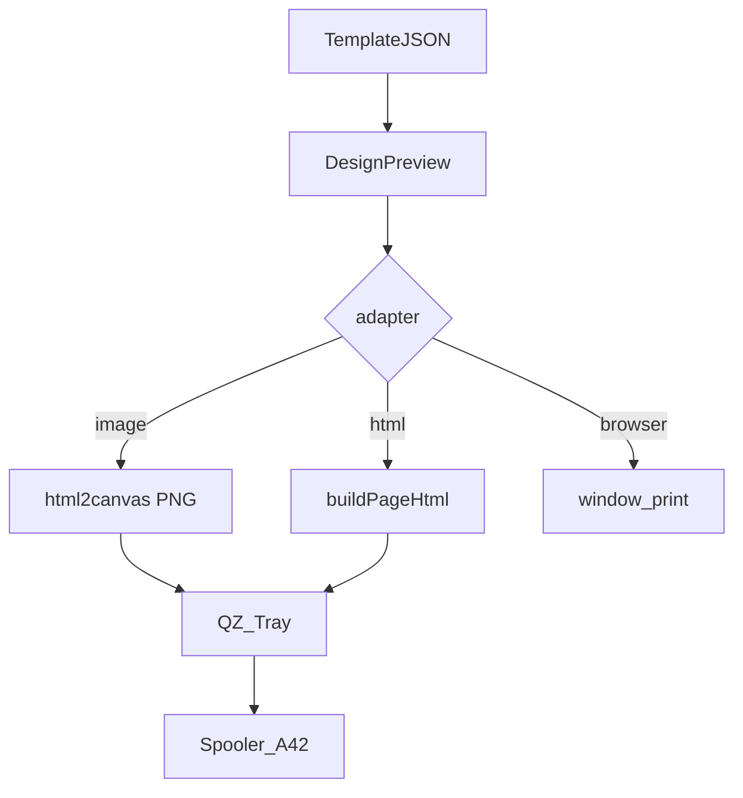

# Web 端热敏标签打印：Vue 3 + QZ Tray + 译维 A42 实践指南

> **摘要**：本仓库的 Vue 3 标签设计器通过 **QZ Tray** 对接 **译维 A42**（Windows GDI 驱动），支持 **QZ HTML**、**QZ 位图**、浏览器原生三种输出。本文说明实现约定，以及纸张错配、裁切、双边框、字重、画布/预览错位等常见问题与解法。  
> 动态变量注入见 [`05_template-variables-and-device-print.md`](./05_template-variables-and-device-print.md)；静默证书见 [`public/certs/README.md`](../public/certs/README.md)。  
> 对外发表友好版本（正文更自洽、可直接粘贴）：[`04_yiwei-a42-qz-tray-bitmap-print-guide.publish.md`](./04_yiwei-a42-qz-tray-bitmap-print-guide.publish.md)。

---

## 一、架构与数据流

### 1.1 方案对比

| 维度 | TSPL / CPCL 指令 | 本方案（Vue 3 + QZ + Windows 驱动） |
| :--- | :--- | :--- |
| 开发 | 手写指令，难预览 | 可视化拖拽，所见即所得 |
| 兼容性 | 绑定品牌指令集 | 有 Windows 驱动即可 |
| 排版 | 表格 / 二维码成本高 | CSS + 组件，JSON 模板 |
| 维护 | 改指令 | 改模板 / `$_{变量}` |

### 1.2 打印通道（设备打印页）

| 适配器 | 值 | 流程 |
| :--- | :--- | :--- |
| QZ HTML | `qz-html`（默认，推荐 A42） | `DesignPreview` 渲染完整 HTML 文档 → QZ `format: 'html'` → 驱动 |
| QZ 位图 | `qz-image` | 同上渲染 → `html2canvas` scale 3 → PNG → QZ `format: 'image'` |
| 浏览器 | `browser` | `window.print`（验版） |


```mermaid
flowchart TD
  A[TemplateJSON] --> B[DesignPreview]
  B --> C{adapter}
  C -->|image| D[html2canvas PNG]
  C -->|html| E[buildPageHtml]
  C -->|browser| F[window_print]
  D --> G[QZ_Tray]
  E --> G
  G --> H[Spooler_A42]
```

实现入口：`src/utils/printService.js`（`printLabelJobs` / `qzHtmlPrint` / `qzImagePrint`）。

---

## 二、实现约定

### 2.1 尺寸

- **1 mm = 5 px**（`PX_PER_MM`）
- 示例：80×60 mm → 画布 **400×300 px**
- 物理纸张：`size: { width: widthMm, height: heightMm }`，`units: 'mm'`
- **不要**向 `qz.configs.create` 传入 `orientation`（见陷阱 1）

### 2.2 QZ HTML

曾用 `transform: scale(calc(mm / px))` 把设计像素压进毫米视口，在 QZ 内嵌 WebKit 上不可靠（易裁切或不出纸），已放弃。

推荐做法：

1. HTML 文档按**设计像素**出图（`body` / `.print-label-inner` = `width × height` px），不做 transform 缩放。
2. 数据项带抓取视口（与 `units: 'mm'` 一致）：

   ```js
   pageWidth: page.width / CSS_PX_PER_MM,   // 96DPI 网页毫米宽
   pageHeight: page.height / CSS_PX_PER_MM,
   ```

3. `config.size` 仍为标签物理 mm；`scaleContent: true` 将抓取结果缩到纸张。

注意：`pageWidth` / `pageHeight` 若误按「英寸数值」传入而 `units: 'mm'`，视口会变成几毫米，表现为 **HTML 模式不出纸**；位图不受影响。

### 2.3 QZ 位图

- 离屏挂载已替换变量的 HTML，注入共用 `PRINT_CSS`，`html2canvas({ scale: 3 })`。
- 与画布同源度量，表格 / 二维码对齐通常比 HTML 模式更稳。
- 字重与 HTML 共用雅黑 + `700`（不用 `text-stroke`，避免热敏糊字）。

### 2.4 表格边框

`html2canvas` **不合并** `border-collapse: collapse`，四边都画会导致相邻线约 2 倍粗。

约定：`border-collapse: separate; border-spacing: 0`；`table` 画上 / 左，`th` / `td` 画右 / 下（单边描边）。边框画在 `th` / `td` 上，保证同行左右列同高。

### 2.5 字重（位图 / HTML 统一）

- 加粗：`Microsoft YaHei` + `font-weight: 700`
- **不要**用 `SimHei` 优先 + `-webkit-text-stroke` 做「合成加粗」（位图热敏易糊成一团）

---

## 三、避坑指南

统一格式：**现象 → 原因 → 解法**。

### 陷阱 1：宽高互换、跨页

- **现象**：一张标签打成两张纸高度。
- **原因**：QZ `orientation` 与驱动纸张方向互相干扰。
- **解法**：`qz.configs.create` **不要**传 `orientation`；只传 `units: 'mm'` + `size: { width, height }`。

### 陷阱 2：左右裁切、上下跨页

- **现象**：内容被切边，或一张打成两张。
- **原因**：Windows 驱动默认底纸不是标签实际尺寸（如不是 80×60）。
- **解法**：打印首选项新建并默认 **80×60 mm、边距 0**；开机 / 换纸后长按进纸键做缝隙学习。

### 陷阱 3：多吐空白页

- **现象**：正文后再吐一张空白标签。
- **原因**：无意义的 `page-break` 或逐张 `qz.print` 时仍强制分页。
- **解法**：单页使用 `page-break-after: avoid`；避免无意义的 always 分页。

### 陷阱 4：细笔画断针 / 显色浅

- **现象**：细线发虚、整体偏淡。
- **原因**：热敏浓度 / 速度与位图分辨率不足。
- **解法**：纯黑 `#000`；位图 `scale: 3`；驱动浓度 12～14、速度 2.0～3.0 in/s；字重见 §2.5。

### 陷阱 5：表格线外细内粗 / 双边框

- **现象**：内线明显比外框粗。
- **原因**：`border-collapse: collapse` 在 html2canvas 中仍会叠线。
- **解法**：单边描边（§2.4）；内层 `div` 不再画框。

### 陷阱 6：画布与预览矩形 / 二维码相对表格错位

- **现象**：预览或打印里二维码相对表格上移 / 多出一小横。
- **原因**：画布与预览度量不一致；行高按 `default.height` 写死 px，未扣组件边框。
- **解法**：
  1. 画布 / 预览统一：`1px` 透明边框（线 / 矩形除外）；表格 `line-height` 勿继承文本的 1.5。
  2. 表格行高按容器 `calc(100% / 行数)` 均分，**勿**用 `default.height` 写死 px。
  3. 二维码 / 矩形绝对坐标尽量贴行线，避免底边落在单元格内。

### 陷阱 7：QZ HTML 只打出左上约 3/4 或不出纸

- **现象 A（裁切）**：只出左上角。  
  **原因**：抓取视口按驱动纸张 mm × 96DPI，小于设计像素。  
  **解法**：§2.2 用 mm 单位的 `pageWidth` / `pageHeight` 盖住设计像素。
- **现象 B（不出纸）**：位图可打、HTML 不行。  
  **原因**：`pageWidth` 单位与 `units: 'mm'` 不一致（误传英寸数值）。  
  **解法**：视口一律按毫米数值传入。

### 陷阱 8：默认模板保存后又被种子盖回

- **现象**：二维码 / 条码改成固定值并保存，再打开又变回 `$_{qr_code}`。
- **原因**：v-model 回写丢掉 `seedVersion`，加载时被当成旧种子整份覆盖。
- **解法**：保存与同步保留 `seedVersion`；有内容仅缺版本时只补版本、不覆盖内容（见 `src/utils/templateStore.js`）。

---

## 四、部署 Checklist

- [ ] QZ Tray 已安装；静默打印证书见 `public/certs/`（证书与私钥勿提交 Git）
- [ ] 译维 A42 默认底纸 = 标签物理尺寸（如 80×60），边距 0
- [ ] 浓度 / 速度按陷阱 4 调节；换纸后缝隙学习
- [ ] `qz.configs` 无 `orientation`
- [ ] 位图 `html2canvas` `scale: 3`
- [ ] HTML 模式确认 `pageWidth` / `pageHeight` 为 mm 且能覆盖画布
- [ ] 设备 `qr_code` 为真实可访问 URL（扫码测连通，勿用假域名）

---

## 五、相关代码与文档

| 路径 | 说明 |
| :--- | :--- |
| `src/utils/printService.js` | 渲染、PRINT_CSS、browser / qz-html / qz-image |
| `src/utils/qzClient.js` | QZ 连接与证书钩子 |
| `src/views/DevicePrintPage.vue` | 设备列表与打印方式切换 |
| `docs/05_template-variables-and-device-print.md` | `$_{变量}` 与设备数据注入 |
| `public/certs/README.md` | 静默打印证书（本地放置，已 gitignore） |

---

## 六、结论

在不绑定 TSPL / CPCL 的前提下，用 Windows 驱动 + QZ Tray 即可完成 Web 标签打印。位图模式对齐最稳；HTML 模式注意抓取视口单位与纸张配置。表格单边描边、字重雅黑 700、画布 / 预览同一套度量，是避免「线粗不一 / 字糊 / 二维码错位」的关键约定。
