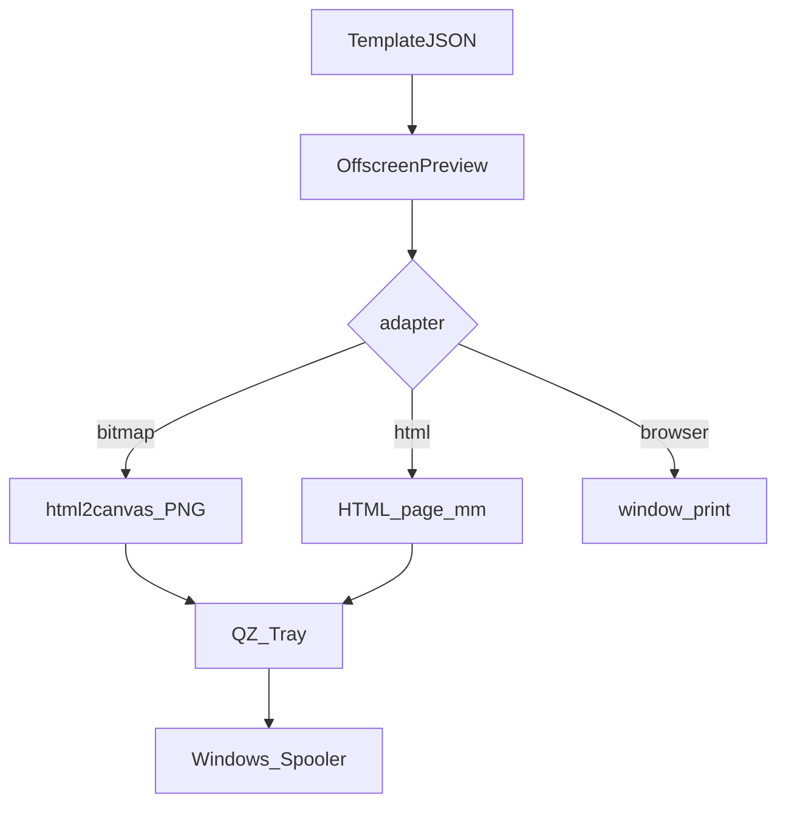

# Web 端怎么把热敏标签打准：Vue 3 + QZ Tray + 译维 A42

浏览器里拖好标签，点打印却裁边、跨页、表格线发粗、二维码对不齐——热敏机 + Windows 驱动这条路上很常见。本文基于一套开源 Vue 3 标签设计器在 **译维 A42** 上的实测，总结可复用的做法：用 **QZ Tray** 走本机驱动，同时支持 HTML / 位图 / 浏览器验版三条通道。

适用读者：要在 Web 里做「所见即所得」标签，又不想绑死某品牌 TSPL / CPCL 指令集的前端或全栈同学。

---

## 一、为什么不用指令集

| 维度 | TSPL / CPCL | 浏览器排版 + QZ + Windows 驱动 |
| :--- | :--- | :--- |
| 开发 | 手写指令，难预览 | 拖拽画布，预览即打印稿 |
| 兼容性 | 绑品牌指令 | 有 GDI 驱动即可换机 |
| 排版 | 表格、二维码成本高 | CSS + 组件 |
| 维护 | 改字符串指令 | 改 JSON 模板和 `${变量}` |

代价是：你要自己搞定**纸张尺寸、抓取视口单位、位图线宽、字重在热敏上的糊字**——下文都是这些坑。

---

## 二、三条打印通道

同一套离屏预览（设计像素上的 DOM），按适配器分流：

| 通道 | 适合场景 | 要点 |
| :--- | :--- | :--- |
| QZ HTML | 译维 A42 等驱动较稳时的默认推荐 | 完整 HTML 交给 QZ，由内嵌引擎出栅格 |
| QZ 位图 | 对齐要求极严、HTML 偶发裁切时 | `html2canvas` 放大 3 倍出 PNG 再打 |
| 浏览器原生 | 没标签机时验版 | `window.print`，不经 QZ |

数据流可以记成一句话：**模板 + 设备字段 → 替换变量 → 离屏渲染 → 选通道出纸**。

---

## 三、几条可复用的实现约定

### 3.1 尺寸：设计像素与物理毫米分开

约定 **1 mm = 5 px**。例如 80×60 mm 画布是 400×300 px。交给驱动的纸张尺寸用毫米：`units: 'mm'` + `size: { width, height }`。

**不要**再传 QZ 的 `orientation`。它和驱动纸张方向叠在一起时，容易把一张标签打成「两张纸高」。

### 3.2 QZ HTML：视口按毫米，内容按设计像素

曾把页面用 `transform: scale(...)` 硬压进毫米视口，在 QZ 内嵌 WebKit 上不稳定（裁切或直接不出纸）。更稳的做法是：

1. HTML 按设计像素铺满（例如 400×300），不做 transform 锁尺。
2. 给 QZ 数据项带上抓取视口宽度 / 高度，数值是**毫米**（按 96DPI 网页换算），并且与 `units: 'mm'` 一致。
3. 配置里 `size` 仍是标签物理毫米；需要时用 `scaleContent` 把抓取结果缩到纸张。

两个对称的坑：

- 视口按驱动纸张算得太小 → 只打出左上角大约 3/4。
- 数值按英寸习惯写、单位却标成 mm → 视口变成几毫米 → **HTML 整单不出纸**，位图却正常。看到「只有 HTML 挂了」时，优先查单位。

### 3.3 QZ 位图：同源度量 + 放大采样

离屏 HTML 与画布同一套度量，再 `html2canvas({ scale: 3 })`。表格和二维码相对位置通常比 HTML 模式更稳；细线与浅字可同时靠提高浓度 / 降速改善。

### 3.4 表格：单边描边

`html2canvas` 不会像浏览器那样好好合并 `border-collapse: collapse`。单元格四边都画，相邻边会叠成约两倍粗。

做法：`border-collapse: separate; border-spacing: 0`；表格画上边和左边，单元格画右边和下边。边框画在 `th` / `td` 上，而不是内层 div，同行左右列才能同高。

### 3.5 字重：雅黑 700，别用描边伪加粗

热敏上 `-webkit-text-stroke` + 黑体优先，容易糊成一团。位图和 HTML 统一：**Microsoft YaHei + `font-weight: 700`**，颜色用纯黑 `#000`。

---

## 四、踩坑实录（现象 → 解法）

**纸张不是 80×60**  
现象：左右裁切、上下跨页。  
解法：在打印机首选项建默认底纸（与标签一致、边距 0）；换纸后做缝隙学习。

**多吐一张空白**  
现象：内容打完再走一张空标。  
解法：单页避免强制 `page-break-after: always`；逐张任务不要无意义分页。

**细线断针、整体偏淡**  
解法：纯黑、位图 scale 3、驱动浓度大约 12～14、速度大约 2.0～3.0 in/s；字重见上一节。

**画布里对齐、预览 / 打印错位**  
常见原因是行高写死像素、未扣 1px 组件边框，或预览继承了文本 `line-height: 1.5`。行高按容器均分（`calc(100% / 行数)`），画布与预览共用同一套边框约定。

**改完默认模板保存，再打开又变回占位符**  
若项目用「种子模板版本号」做升级覆盖，保存时丢掉版本字段，加载会当成旧种子整份盖掉用户改动。持久化时务必带上版本元数据；仅缺版本时补版本，不要清空内容。

---

## 五、落地 Checklist

- [ ] 本机已装并运行 [QZ Tray](https://qz.io/download)
- [ ] 驱动默认纸张 = 标签物理尺寸，边距 0；换纸后缝隙学习
- [ ] QZ 配置不传 `orientation`，纸张用 mm
- [ ] HTML 通道的抓取宽高是 mm，且盖住设计像素
- [ ] 位图通道 `html2canvas` scale 为 3
- [ ] 表格单边描边；加粗用雅黑 700，不用描边伪粗
- [ ] 需要静默打印时，按项目说明本地放置证书（勿把私钥推进公开仓库）
- [ ] 二维码内容用真实可访问 URL 做扫码连通测试

---

## 六、小结

Web 标签打印不必绑死指令集：设计器出 HTML，QZ Tray 接到 Windows 驱动即可。译维 A42 上，**HTML 适合日常默认，位图适合抠对齐**；真正决定成败的往往是纸张配置、视口单位、边框叠线与字重，而不是「再找一个打印插件」。

---

## 附录：开源实现对照

完整可运行项目与本文对应的仓库文档（含源码路径表）：

- 仓库：`https://github.com/<org>/<repo>`（发表前替换为真实地址）
- 实践指南（带文件路径）：`docs/04_yiwei-a42-qz-tray-bitmap-print-guide.md`
- 变量注入：`docs/05_template-variables-and-device-print.md`
- 打印入口：`src/utils/printService.js`
- QZ 连接与证书钩子：`src/utils/qzClient.js`
- 静默证书说明（证书本身不入库）：`public/certs/README.md`

实测机型：**译维 A42**；画布约定：**1 mm = 5 px**。其他 GDI 热敏机可沿用同一思路，纸张与浓度需按机型微调。
